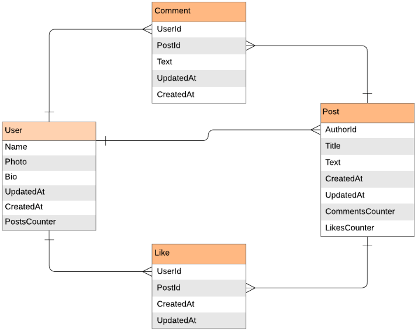

  
  
     
  <h2><b>Blog App</b></h2>

  

# 📗 Table of Contents

- [📖 About the Project](#about-project)
  - [🛠 Built With](#built-with)
    - [Tech Stack](#tech-stack)
    - [Key Features](#key-features)
  <!-- - [🚀 Live Demo](#live-demo) -->
- [💻 Getting Started](#getting-started)
  - [Setup](#setup)
  - [Prerequisites](#prerequisites)
  - [Install](#install)
  - [Usage](#usage)
  - [Run tests](#run-tests)
  <!-- - [Deployment](#triangular_flag_on_post-deployment) -->
- [👥 Authors](#authors)
- [🔭 Future Features](#future-features)
- [🤝 Contributing](#contributing)
- [⭐️ Show your support](#support)
- [🙏 Acknowledgements](#acknowledgements)
<!-- - [❓ FAQ (OPTIONAL)](#faq) -->
- [📝 License](#license)

 

# 📖 Blog App 
> The Blog App is a classic blog website that shows the list of posts and empowers readers to interact with them by adding comments and liking posts. 
 

## 🛠 Built With 
- Ruby
- Rails
- PostgreSQL
- Linters

### Tech Stack 

  
Client

  <ul>
    <li><a href="https://www.ruby-lang.org/en/">Ruby</a></li>
    <li><a href="https://guides.rubyonrails.org/">Rails</a></li>
    <li><a href="https://www.postgresql.org/">PostgreSQL</a></li>
  </ul>

 

### Key Features 
- Creating a data mode
- Validations and Model specs
- Processing data in models
- Setup and controllers
- Controllers specs
- Views
- Forms
- Integration specs for Views and fixing n+1 problems
- Add Devise
- Add authorization rules
- Add API endpoints
- API documentation

(<a href="#readme-top">back to top</a>)

<!-- ## 🚀 Live Demo  -->
<!-- >[Live Demo](https://airmetrics.onrender.com) -->

<!-- > [Video Presentation](https://www.loom.com/share/2ad53b4776e94f43bb9c464cf7a63c5e?sid=014845e4-9b2d-4449-9e89-59e30a0f64d4) -->
<!-- 
(<a href="#readme-top">back to top</a>)
 -->

## 💻 Getting Started 
To get a local copy up and running, follow these steps:

### Prerequisites
In order to run this project you need:
- A browser of you choice.
- A text editor of your choice.
- Install ruby gem and depencies on your local system
- Install Postgresql

### Setup

Clone this repository to your desired folder:

- Use the following Commands:
  git clone https://github.com/momo-87/blog-app.git
  cd recipe-app
### Usage
- bundle install
- rails s
### Run tests
- Run the following script and style test:
<!---To be done-->

<!-- ### Deployment
> npm run build -->

(<a href="#readme-top">back to top</a>)

## 👥 Author 
👤 Christian Romuald MOMO TONFACK
- GitHub: [@githubhandle](https://github.com/Momo-87)
- LinkedIn: [LinkedIn](https://www.linkedin.com/in/christian-momo/)
- Twitter: [@twitterhandle](https://twitter.com/Momo_yde)

(<a href="#readme-top">back to top</a>)

## 🔭 Future Features 
- [ ] Build and deploy the whole application.

(<a href="#readme-top">back to top</a>)

## 🤝 Contributing 
> Contributions, issues, and feature requests are welcome!
Feel free to check the [issues page](https://github.com/momo-87/blog-app/issues).

(<a href="#readme-top">back to top</a>)

## ⭐️ Show your support 
>If you like this project just give it a star ⭐️.

(<a href="#readme-top">back to top</a>)

## 🙏 Acknowledgments 
>I would like to thank Microverse comnunity for their supports.

(<a href="#readme-top">back to top</a>)

## 📝 License 
>This project is [MIT](./LICENSE) licensed.

(<a href="#readme-top">back to top</a>)
